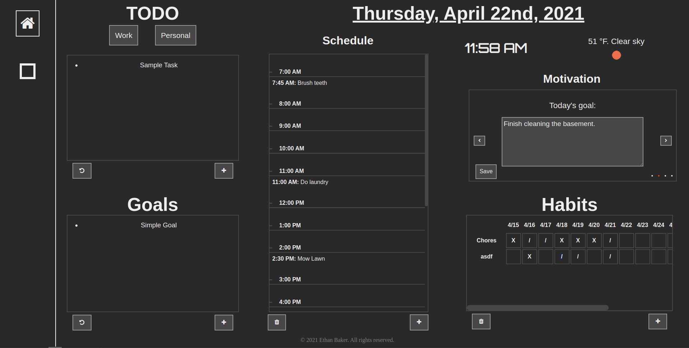

# Productivity GUI

A productivity tool built with Javascript in the web browser, found here [https://productivity.ethanbaker.dev](https://productivity.ethanbaker.dev). 

## Demo

Currently, only registered users can use this tool. In the meantime, you can check out the demo.

[https://productivity.ethanbaker.dev](https://productivity.ethanbaker.dev?DEMO).

## Features

Available widgets:

* TODO List
* Goal List
* Ambient (Time, weather, etc)
* Schedule
* Habit Tracker
* Motivation (Daily goals, targets, etc)

## Contributing / Suggestions

If you would like to help develop this project, let me know at [mail@ethanbaker.dev](mailto:mail@ethanbaker.dev).

For issues and suggestions, please include as much useful information as possible. Please submit patches as pull requests. 
